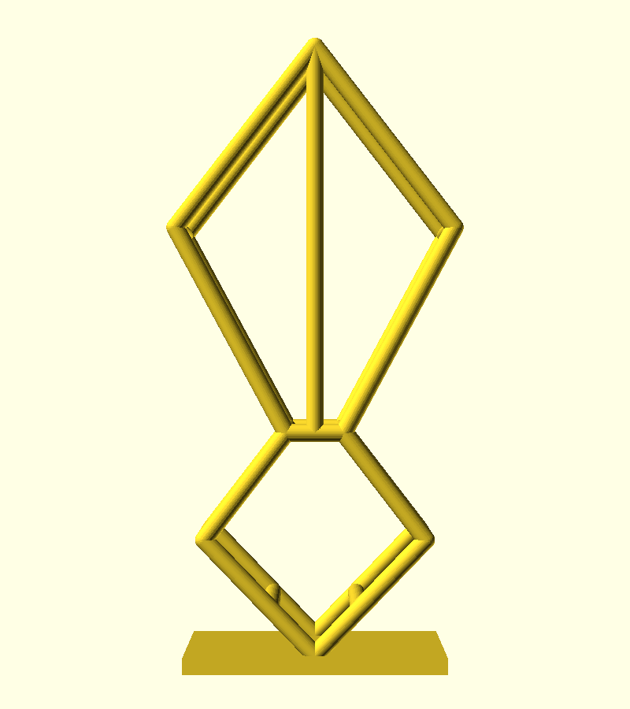

# Air Plant Holder — Double-Diamond Wireframe Cage

A geometric display stand for the tall Tillandsia (the leftmost plant, caput-medusae type). Two stacked diamonds accentuate the plant's height, built as a full 3D wireframe cage — identical front and back frames joined by depth struts, with no solid faces, so the plant shows through the large front diamond opening.



## Plant measurements (from caliper photo)

- Full plant height: ~135mm
- Bulb width: ~40mm
- Bulb depth: ~30mm

## Model dimensions

- Overall height: 152mm
- Base plate: 64 × 42 × 4mm, flat for table placement, with an 8mm drainage hole under the bulb
- Cage depth: 32mm (strut centers), sized to the bulb
- Struts: 4.4mm diameter round
- Lower diamond: 54mm wide, with cradle ribs that support the bulb
- Upper diamond: 68mm wide, with a center vertical spine on the back frame only
- Both diamonds are full 3D: front and back wireframes connected at every corner

## Design intent

- **Geometric**: stacked diamond silhouette per the sketch
- **Height-accentuating**: the tall upper diamond frames the plant's leaves and tops out just above them
- **Open front**: no solid faces anywhere; the front diamond opening (68 × 94mm) leaves the plant fully visible, and the center spine sits on the back frame
- **Flat base**: sits flat on a table; the bulb wedges into the lower V and rests on two cradle ribs

## Printing

- Print upright as modeled, PLA or PETG
- 0.2mm layers; the horizontal front-to-back connectors bridge ~32mm, which most printers handle without support (enable supports if your bridging is poor)
- No infill to speak of — the part is struts and a thin plate
- ~30g of filament

## Customization

Key parameters at the top of `air_plant_holder_001.scad`:

```openscad
zT = 152;        // overall height
w2 = 34;         // upper diamond half-width
depth = 32;      // cage depth (match bulb depth)
strut_r = 2.2;   // strut radius
```

## Files

- `air_plant_holder_001.scad` — OpenSCAD source
- `air_plant_holder_001.stl` — validated, print-ready mesh
- `preview_front.png`, `preview_iso.png`, `preview_side.png` — renders
